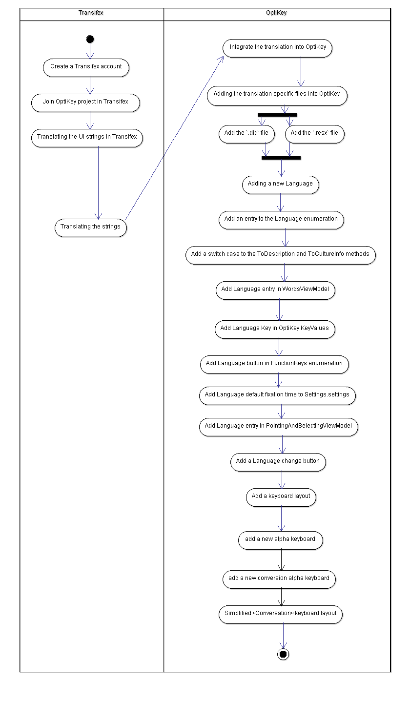

# Views and prespectives 

## OptiKey Fork

* [OptiKey Fork](https://github.com/adirel/OptiKey) - this is our fork to the OptiKey project
* [OptiKey Fork - Modeling documentation folder](https://github.com/adirel/OptiKey/tree/master/docs/Modeling) - we created a new modeling folder into the OptiKey project in our fork.

## Documentation and general source code structure is as follows

* OptiKey project includes a "docs" folder which contains general information such as credits, graphic design notes and some of the deployment proccess of the project.
* [OptiKey wiki](https://github.com/OptiKey/OptiKey/wiki) - contain a full user guide about the UI, general information, technical support, troubleshooting and installation proccess.
* [Video](https://www.youtube.com/watch?v=HLkyORh7vKk) - there is an intro video which is very helpfull.
* general source code structure - is a typicaly .Net formation project of WPF architecture. this is a very importent part which called "enums" and its decribe major part of the system code structure.
 general formation appears to be divided into external tools and main source code (divided by two folders) . inside the source code folder we can detect its seperated into three main areas - Main Source, Unit tests and Auto Complete Performance which is another user test cases and automaticly unit testing focus on performance. 
 

## Main features of the product and stakeholders view
OptiKey is an assistive on-screen keyboard. It is designed to be used with a low cost eye-tracking device to bring keyboard control, mouse control and speech to people with motor and speech limitations. 

OptiKey is an assistive on-screen keyboard which is designed for a wide range of stakeholders:

1. OptiKey is designed to be used with a low cost eye-tracking device to bring keyboard control, this helps to people who has motor limitation (can not use their hands with normal keyboard).
2. It is designed to comprehend speech for people with speech limitations as well.
3. It is also designed to be used with mouse control for general population.
4. OptiKey uses a Low cost certificate for Open Source projects from www.certum.eu wich is one of the main resources available quickly and cheeply for a customers production key and certificat.

People with motor and speech limitations, such as people living with Amyotrophic Lateral Sclerosis (ALS) / Motor Neuron Disease (MND), can use this incredible keyboard.

Main Features:
* [Typing words](https://github.com/OptiKey/OptiKey/wiki/Type-your-first-word)
* [Writing Numbers, symbols and diacritics](https://github.com/OptiKey/OptiKey/wiki/Numbers,-symbols-and-diacritics)
* [Using eye trackers](https://github.com/OptiKey/OptiKey/wiki/Using-eye-trackers)
* [Using webcams](https://github.com/OptiKey/OptiKey/wiki/Using-webcams)
* [Change selection method](https://github.com/OptiKey/OptiKey/wiki/Change-selection-method)
* [Speech](https://github.com/OptiKey/OptiKey/wiki/Speech)
* [Voice banking](https://github.com/OptiKey/OptiKey/wiki/Voice-banking)
* [Simulate a keyboard](https://github.com/OptiKey/OptiKey/wiki/Simulate-a-keyboard)
* [Simulate a mouse](https://github.com/OptiKey/OptiKey/wiki/Simulate-a-mouse)
* [Multi key selection](https://github.com/OptiKey/OptiKey/wiki/Multi-key-selection)
* [Auto Suggestions](https://github.com/OptiKey/OptiKey/wiki/Suggestions)
* [Auto capitalisation & auto spacing](https://github.com/OptiKey/OptiKey/wiki/Auto-capitalisation-&-auto-spacing)
* [Dictionary](https://github.com/OptiKey/OptiKey/wiki/The-dictionary)
* [Change Sizes & Positions](https://github.com/OptiKey/OptiKey/wiki/Size-&-position)
* [Transparency](https://github.com/OptiKey/OptiKey/wiki/Transparency)
* [Theme](https://github.com/OptiKey/OptiKey/wiki/Change-the-theme)
* [Conversation mode](https://github.com/OptiKey/OptiKey/wiki/Conversation-only-mode)
* [Sleep](https://github.com/OptiKey/OptiKey/wiki/Sleep)
* [Speed up & slow down](https://github.com/OptiKey/OptiKey/wiki/Speed-up-&-slow-down)
* [Visual settings](https://github.com/OptiKey/OptiKey/wiki/Visual-settings)
* [Sound settings](https://github.com/OptiKey/OptiKey/wiki/Sound-settings)
* [Word settings](https://github.com/OptiKey/OptiKey/wiki/Word-settings)
* [Pointing & selecting settings](https://github.com/OptiKey/OptiKey/wiki/Pointing-&-selecting-settings)

## Analysis and description of the major & important designs with UML diagrams and other modelling means

One of the most important stages which represent a open source communinity is adding value and system expandad measures.
The following diagram describes the 4 stages which are needed to add a new locale.
* UI element translations
* word dictionary
* keyboard layout
* integration into OptiKey
 

* [Check out JuliusSweetland and our team conversation about Localisation module review](https://github.com/OptiKey/OptiKey/issues/269)

## OptiKey - Features and challenges
Issues:
* [Smart Screen or Virus Scanner warnings](https://github.com/OptiKey/OptiKey/wiki/Smart-Screen-or-Virus-Scanner-warnings)
* [Cannot open Management Console](https://github.com/OptiKey/OptiKey/wiki/Cannot-open-Management-Console)
* [Eye tracker problems](https://github.com/OptiKey/OptiKey/wiki/Eye-tracker-problems)
* [Factory reset all settings](https://github.com/OptiKey/OptiKey/wiki/Factory-reset-all-settings)
* [Factory reset the dictionary](https://github.com/OptiKey/OptiKey/wiki/Factory-reset-the-dictionary)
* [Multiple monitors](https://github.com/OptiKey/OptiKey/wiki/Multiple-monitors)
* [No menu key, no mouse key](https://github.com/OptiKey/OptiKey/wiki/No-Menu-key,-no-mouse-key)
* [Multi-key selection issues](https://github.com/OptiKey/OptiKey/wiki/Multi-key-selection-issues)
* [OS language has changed](https://github.com/OptiKey/OptiKey/wiki/OS-language-has-been-changed)

Localisation: 
* [Italian](https://github.com/OptiKey/OptiKey/issues/264)
* [Croatian](https://github.com/OptiKey/OptiKey/issues/263)
* [Slovene](https://github.com/OptiKey/OptiKey/issues/248)
* [Catalan](https://github.com/OptiKey/OptiKey/issues/235)
* [Polish](https://github.com/OptiKey/OptiKey/issues/238)
* [Portuguese](https://github.com/OptiKey/OptiKey/issues/234)
* [General](https://github.com/OptiKey/OptiKey/issues/148)

Bugs:
* [Disconnects from Eye Tribe Tracker](https://github.com/OptiKey/OptiKey/issues/254)

Wishlist:
* [Allow input from mouse and eye tracker](https://github.com/OptiKey/OptiKey/issues/228)
* [Multiple Dictionaries](https://github.com/OptiKey/OptiKey/issues/218)
* [Running OptiKey on system with multiple screens](https://github.com/OptiKey/OptiKey/issues/175)
 

