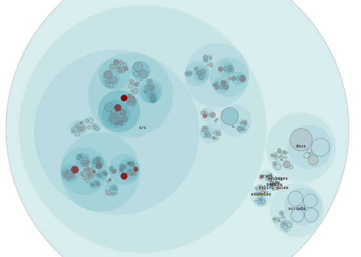
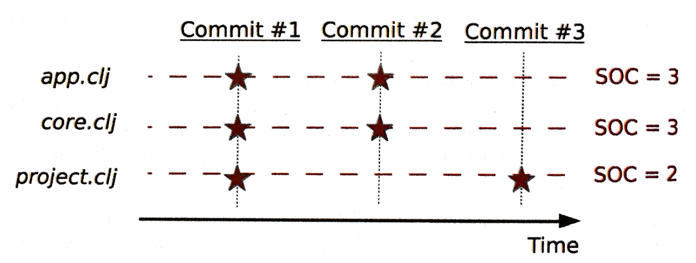
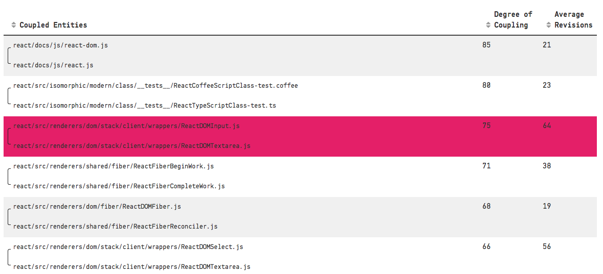
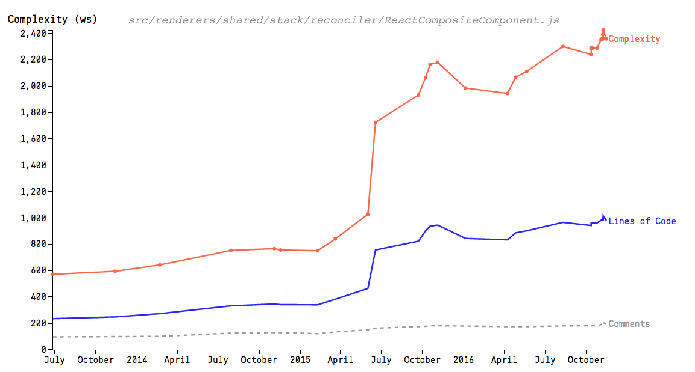
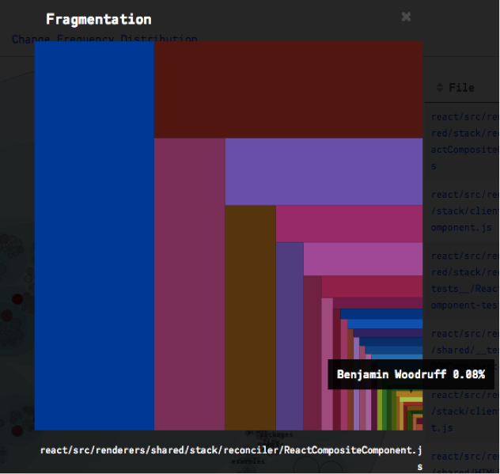
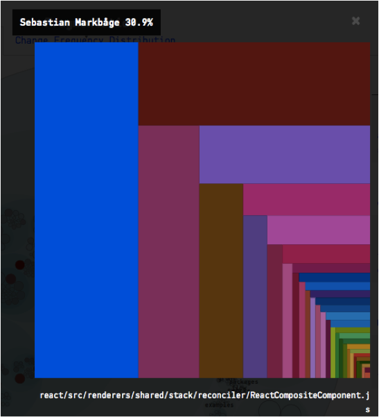

## Metrics, Variability and Quality Measures

In order to access code quality we chose to follow the chose to follow the forensic approach and metrics presented by [Adam Tornhill](http://adamtornhill.com/) in his book [Your Code as a Crime Scene](https://pragprog.com/book/atcrime/code-as-a-crime-scene). 

Following we will explain the approach, define a few of the metrics and apply them on the React code base, followed by a brief discussion. 

### The Approach

Static code analysis can only bring us so far. It only inspects a snapshot of the codebase and can surely bring results, showing the interplay of classes, finding [code smells](https://sourcemaking.com/refactoring/smells) or style deviations. The premise of the book is that code and system design changes over time, and by monitoring and analyzing exactly those changes we can discover trends previously not seen using only static analysis techniques.

### Hotspots
>If many people change a file often, it hase many reasons to change.. [violating the Single Rresponsibility Principle]
--Adam Tornhill

Like geographical crime hotspots help the police to pinpoint areas with higher probablity of a crime being commited, code hotspots indicate code areas, where a lot is happening. Modules, classes or files which change a lot have also a higher risk of brining in bugs and unintended behaviour. According to Adam Tornhill, it violates the [Single Responsibility Principle](https://en.wikipedia.org/wiki/Single_responsibility_principle), one of the core design principles of [SOLID](https://en.wikipedia.org/wiki/SOLID_(object-oriented_design)) object oriented design. In contrast, part of the application which do not change that frequently can be an indicator for a rather stable and modular codebase. 

The react project has as of right now about **4.2%** of its code base marked as Hotspots with **18.8%** of all the development happening around this code. In order to get a better perspective, a (short comparison)[https://codescene.io/showcase] of other open source projects can help us bring the numbers in perspective:

| Project  | LOC  | # of Contributors  |  Hotspots (%)  | Development in Hotspotss (%)  |
|---|---|:---:|:---:|:---:|
|  Elasticsearch | 707,838  |  221 | **0.5** | **8.2**  |
|  Rails | 257,315  |  503 | **0.8** | **5.8**  |
|  ASP.NET | 332,076  | 123  | **2.2**  | **12.2**  |
|  *React* | *127,331*  | *483*  | ***4.2***  | ***18.8*** |
|  Numpy | 222,507  |  505 | **9.8** | **13.2**  |

It surely depends on other metrics such as number of contributors, project maturity, etc. While React's numbers seem not that high, compared to other frameworks such as *ASP.NET* or *Rails*, the percentage of hotspots seems to be rather high.

### Temporal Coupling

Files which change together (i.e. in the same commit) tend to be coupled. The following picture explains the concept of temporal coupling.

There are 3 files in the system, changed over the history of 3 commits. The file *app.clj* was changed in 2 commits (#1 & #2). In the commit #1, 2 other files were also changed, while commit #2 affected only 1 other file. So the score for *app.clj* is 3, the total sum of files it has changed with. *project,clj* on the other hand only has the score of 2.

When files change together, it can be an indicator for several things:

* internal APIs change a lot
* "copy paste" code
* code repetition (less [DRY](https://en.wikipedia.org/wiki/Don%27t_repeat_yourself) code)

#### Not all temporal coupling is bad

While the goal is to reduce temporal coupling, not all of it is bad. Tight copuling between test files and files being tested is in general a good sign and means, that the code is well tested and also that the tests evolve over time together with the code base and are not being neglected.

The following analysis provides more insights into React's coupling. A look on *ReactDOMInput.js* and *ReactDOMTextarea.js* which have a *75%* temporal coupling bring up some questions. Though it is hard to judge the code base without carefully investigating and understanding it, *input* and *textarea* seem to be related concepts, which probably explains why the files change over time. It is open for discussion, if those changes could or could not be made redundant by introducing an abstraction level in form of a parent class incorporating the commonalities between the two.

### Complexity

There exist (complex) metrics like [Cyclomatic Code Complexity](http://www.linuxjournal.com/article/8035) which can help us reason about complexity of a given code base, by building out a graph of the code base and the method calls, counting edges, etc. Adam Tornhill though takes another approach, relying totally on the visual structure of the code. In her [talk](https://youtu.be/8bZh5LMaSmE?t=299) at the RailsConf 2014 Sandi Metz introduced the socalled "Squint Test". Opening up the IDE, squinting one's eyes and looking on the code, we want to look out for:

* Changes in shape
* Changes in color

Changes in *shape* are an indicator for lots of nested conditions. When you see frequent changes in color it means that  code may not have the same level of abstraction, possible using strins, constants and variables which are colored differently by most IDEs.

In the graph we see that aroung May/June of 2015 the LOC on *ReactCompositeComponent.js* approximately doubled from aroudn 250 to 500, while the complexity measure of this file seems to have quadrupled. Watching out for such changes can help identify potentially complex part of the application, which is the first step in reducing complexity.

### Knowledge Maps and Organizational Structure

>...organizations which design systems ... are constrained to produce designs which are copies of the communication structures of these organizations
--M. Conway

