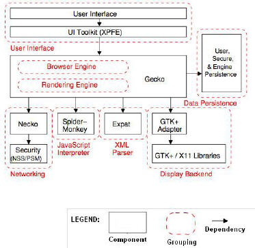
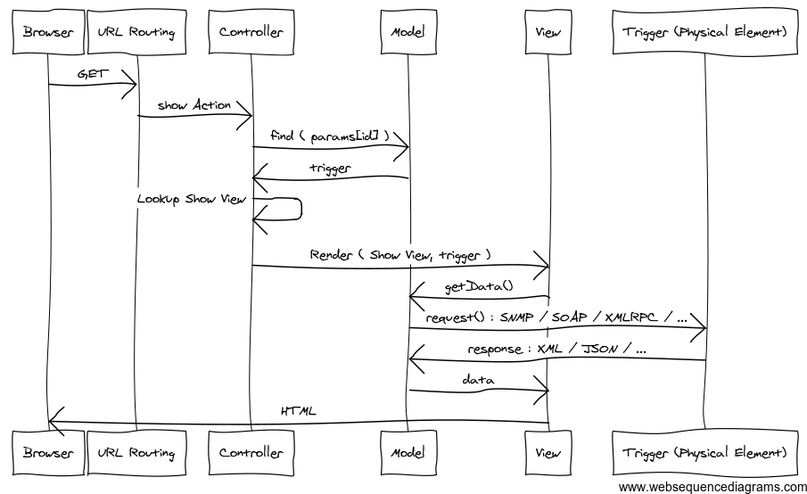

## firefox-ios - Class Project

Stage 0:

1. Project name: 
  - firefox-ios - firefox browser for ios
  - [firefox-ios Repository](https://github.com/mozilla/firefox-ios)
2. Team members:
    - [Rawi Sakhnini](https://github.com/rawisa)
    - [Marian Raad](https://github.com/marianera)
	

## Introduction

Firefox for iOS is a browser from Mozilla, for the Apple iPhone, iPad and iPod touch mobile devices.
It is the first Firefox branded browser to not use the Gecko layout engine as is used in Firefox for desktop and mobile. Due to Apple's application review policies, Firefox uses the built-in iOS WebKit-based rendering framework instead of Gecko.
Firefox for iOS supports Firefox Sync and is able to sync Firefox's browsing history, bookmarks, and recent tabs.

## Architecture

**A general browser architecture:**

[Reference](http://image.slidesharecdn.com/web-browserarchitecture-150609231155-lva1-app6892/95/web-browser-architecture-2-638.jpg?cb=1433891674)

**Firefox** architecture looks as the following figure, but because of Apple policies they had to use the build-in ios WebKit instead of gecko.

[Reference](http://www.shinylight.com/wp-content/uploads/2009/09/11.jpg)

## Resources 

Firefox is an open-source browser, users around the world help to improve it.
Contributers can communicate through: 
* IRC:            [#mobile](https://wiki.mozilla.org/IRC) for general discussion and [#mobistatus](https://wiki.mozilla.org/IRC) for team status updates.
* Mailing list:   [mobile-firefox-dev@mozilla.org](https://mail.mozilla.org/listinfo/mobile-firefox-dev).

They can find the bugs that need to be fixed at the following list:

* Bugs:           [File a new bug](https://bugzilla.mozilla.org/enter_bug.cgi?bug_file_loc=http%3A%2F%2F&bug_ignored=0&op_sys=iOS%20&product=Firefox%20for%20iOS&rep_platform=All) • [Existing bugs](https://bugzilla.mozilla.org/describecomponents.cgi?product=Firefox%20for%20iOS) 

# Statics

**The weekly commits:**

[Reference](https://github.com/mozilla/firefox-ios/graphs/commit-activity)

**Notice the high code change frequency:**

[Reference](https://github.com/mozilla/firefox-ios/graphs/code-frequency)

Looking at the following release frequency, one can understand that firefox uses the agile method.
Also according to [itbusinessedge](http://www.itbusinessedge.com/cm/blogs/all/mozilla-takes-hybrid-approach-to-agile-software-development/?cs=38988):
"Mozilla has also begun using a hybrid model that incorporates elements of both agile and waterfall approaches for its flagship Firefox Web browser. The goal is to more quickly introduce new features -- aided by agile's emphasis on iterative releases -- while maintaining backward compatibility, security and overall code quality.".

[Reference](https://github.com/mozilla/firefox-ios/releases)

Firefox has bugs/features list in their [issues](https://github.com/mozilla/firefox-ios/issues) in github:

[Reference](https://github.com/mozilla/firefox-ios/issues)

## Contributor guidelines

Using Firefox official site [Bugzilla](https://bugzilla.mozilla.org/). Developers can find a list of bugs in firefox
All developers must follow the following Swift style to keep the code orginized: https://github.com/raywenderlich/swift-style-guide.

With small * Exception: they use 4-space indentation instead of 2.

Further info can be found at [Firefox-ios contributor guidelines](https://github.com/mozilla/firefox-ios#contributor-guidelines)

## General source code structure

Firefox seperates code to packages to keep everything orginized to help developers add/fix features with an ease.
The following figure shows the code structure, one can see there is packages for : Account, Client, Extensions, etc... 
For most packages there is a corresponding package for tests:  AccountTest, ClientTest, etc... . That way if firefox-developers or external-contributers do changes, they dont break the browser functionality.
general detailed code structure can be found at (note: this code structure are for windows, but its the same for all platforms in general):
* https://developer.mozilla.org/en-US/docs/Mozilla/Developer_guide/Source_Code/Directory_structure
* http://codefirefox.com/video/source-structure

[Reference](https://github.com/mozilla/firefox-ios)

## Stakeholder view
* **Communicators**:

 are the people that provide documentation for the users and administrators of the system.
 Furthermore they may provide training for staff or the development team.
 Often communicators promote the product by communicating the product's key features and benefits to other stakeholders.

 Firefox is a global webbrowser, They have a "Mobilizers" community. Mobilizers are tech/geek enthusiasts that are committed to spreading Firefox OS, Mozilla's new mobile product. Mobilizers receive periodic missions asking them to do a simple action to teach others about the new Firefox OS. Mobilizers will also attend, assist or host events in their market about once a month [Reference](https://wiki.mozilla.org/FirefoxOS/Community/Mobilizers).

* **Developers**:

 are responsible for the implementation and deployment from the systems' specification.
 That is: design, code, test and accept.
 Their concerns lie with the platform used, programming languages for writing code, tools used, dependencies needed, as well as the maintainability and flexibility of the system.

 The most active and notable developers at this moment are: Stefan Arentz, Brian Nicholson, Stephan Leroux and Richard Newman. These developers create pull requests with new features or fixes (Stefan Arentz does only fixes for bugs). It is important to note that these are not the only developers working on the firefox project. The most core team can be found at [Firefox-team](https://wiki.mozilla.org/Firefox/Team/whois).

* **Testers**:

 test the system to ensure that it works exactly the way it was intended to work.
 
 [Stephan Leroux](https://github.com/sleroux) and [Brian Nicholson](https://github.com/thebnich), contribute the most to the tests, code tests, UI tests, etc... 

* **Funders**:

 Funders give money to the project to keep it alive.
 
 One of the best money incoming for firefox are the search engines such as Google, who pays firefox to make Google search engine as the default search engine for firefox.
 
* **Users**:
 
 define the system's functionality and use it once it has been deployed.
 
 Users use the browser to surf the internet, they expect it to be fast, and wait for new updates for bug fixes or new feature to fully enjoy surfing the internet.
 
* **Development team**:
 * Product Manager: Jen Bertsch
 * Project Manager: Mike Alexis
 * Content owner: Greg Jost
 * Copy: Natalie Linden
 * UX and Design: ZURB
 * Creative lead: Tim Murray
 * Foundation stakeholder: Andrea Wood
 * Advocacy stakeholder: Jochai Ben-Avie
 * Legal: Mika Devi
 * Web dev: Craig Cook
 * Analytics: Gareth C
 * L10N: Flod, Pascal Chevrel
 
 [Reference](https://wiki.mozilla.org/Websites/Mozilla.org/Smart_On)
 
 ## UML - Sequence diagram
 
 The following sequence diagram shows the important part of any webbrowser and how it works, how the MVC works in firefox:
 
 

[Reference](http://blog.quent.in/assets/wp-content/uploads/2012/04/index.png)
 
 
## Missing important feature
  
  According to [bugzilla](https://bugzilla.mozilla.org). Firefox is missing an important feature which filed at https://bugzilla.mozilla.org/show_bug.cgi?id=1228089. The feature is: "Detect if the user has a URL in their clipboard when re-entering the app", The browser currently checks if there is copied URL only when the app opens for the first time and not when the app goes background -> user copies URL -> enters the browser again.
  
  At it is recommended for the new contributers to add that features.
  
  Following [Swift style]( https://github.com/raywenderlich/swift-style-guide) which was recommended by firefox. We added the new feature, and created a pull request and attached it on there bugzilla site according to there [guidelines](https://github.com/mozilla/firefox-ios#contributor-guidelines)
  
  * [Forked repo.](https://github.com/rawisa/firefox-ios)
  * [PR](https://github.com/mozilla/firefox-ios/pull/1889) For the missing feature.
  
  
## Metrics, Variability and Quality Measures
* **circleci**:

  
  
  Firefox uses circleci for continuous integration. CircleCI’s continuous integration and delivery platform helps software teams rapidly release code with confidence by automating the build, test, and deploy process. CircleCI offers a modern software development platform that lets teams ramp quickly, scale easily, and build confidently every day.
  Over 100,000 companies uses circleci, such as: Facebook, Kickstarter, Spotify, GoPro, etc...
  
  
  
  circleci can be easily installed, run tests and automatically have each successful build on master be pushed to any deployment host.
  
  For the PR we made it took circleci about 10 minutes to run all the tests by mainly running the following command which executes all the tests in the project:
 
  **"set -o pipefail && xcodebuild CODE_SIGNING_REQUIRED=NO CODE_SIGN_IDENTITY= PROVISIONING_PROFILE= ONLY_ACTIVE_ARCH=NO VALID_ARCHS="i386 x86_64" -destination 'platform=iOS Simulator,name=iPhone 4s,OS=9.3' -sdk iphonesimulator -project 'Client.xcodeproj' -scheme "FennecCI" clean build test | tee $CIRCLE_ARTIFACTS/xcode_raw.log"**
  
  It ran 263 tests in xcode with 0 failures. When the tests finishes it shows a green arrow on the PR to verify that our build passed all tests:
  
  
  
  
  
* **codebeat**:  

  
  Codebeat gives instant feedback on the code. It is Automated code review for Swift, Ruby, Go, etc... 
  
  codebeat gathers the results of code analysis into a single, real-time report that gives all project stakeholders the information required to improve code quality.
  
  Firefox has a *3.02 GPA*, *B* grade according to Codebeat 
  
  Codebeat report comes with a number that can range from 0 (worst) to 4 (best). Codebeat explains how [Calculating GPAs](https://hub.codebeat.co/docs/gpa-explained#calculating-gpas).
  
  According for firefox-ios's codebeat https://codebeat.co/projects/github-com-mozilla-firefox-ios . They have many problems in a class called "BrowserViewController.swift":
  
  * Too many methods - 198 methods
  * Too many instance variables - 32 instance variables
  * Namespace too long - 2344 lines of code
  * Total complexity too high - complexity = 1312
  
  And have a code duplication in *"Client/Frontend/Browser/BrowserTrayAnimators.swift:205...217"* and *"Client/Frontend/Browser/BrowserTrayAnimators.swift:219...231"* .
  
  
  
  
  * [Total complexity](https://hub.codebeat.co/v1.0/docs/namespace-level-metrics#total-complexity) : 
  
  Total complexity represents aggregate Assignment Branch Condition size of the entire namespace. High total complexity indicates a namespace that contains too much logic and should probably be broken down into smaller elements.
  
  
  * [Lines of code](https://hub.codebeat.co/v1.0/docs/namespace-level-metrics#lines-of-code) : 
  
  This represents the total length (code-wise) of a namespace. It is probably the most naive metric among the ones that we report on but can nevertheless provide substantial value. Ideally a single logical unit of code (class, module, etc.) should fit on one screen, without the need for scrolling. Longer namespaces are harder to navigate and understand, making your code less maintainable.
  
  
  * [Number of functions](https://hub.codebeat.co/v1.0/docs/namespace-level-metrics#number-of-functions) : 
  
  Number of functions is another high-level complexity metric. It is designed to encourage smart composition and modularity instead of refactoring code by multiplying private methods. We believe that a namespace with more than 15 (private and public) functions is a good candidate for breaking up into multiple independent modules each with it's own set of data.
  
  
  * [Number of instance variables](https://hub.codebeat.co/v1.0/docs/namespace-level-metrics#number-of-functions) : 

  Number of instance variables is a metric designed to detect classes that carry too much state. Since every instance variable has an impact on the overall of status of the object the more instance variables you have the more possible states your object can have and this number grows exponentially as you keep adding instance variables.
	
	
	
  The Following image shows the errors and how they are presented in the "BrowserViewController.swift" class:
	
  

  
  
## Security
  
  
  **Firefox 4:**
  
  Firefox presented a Sync 1.0, which creates a unique secret key, which was used to encrypt and decrypt all your data. And the only way to get the data was to know that key.
  
  
  **Problems with Sync 1.0**
  
  If you lose your only device, you probably also lost the only copy of your secret key, and without that key, there was no way to recover your Sync data.
  
  
  **Firefox 29:**
  
  features a brand new Firefox Sync experience that is much easier to use while maintaining the high standard of safety, security, and openness that a user expects from Mozilla.  
  
  The security goals remain the same: there is still a strong random secret key, and Mozilla’s servers cannot decrypt your data.
  However, instead of using pairing, a “wrapped” version of your secret key, protected by your password, is stored alongside your Firefox Account.
  This means you can recover all your data, even if you lose all your devices at the same time.
  Setting up a new device only requires typing your Firefox Account email and password into it.
